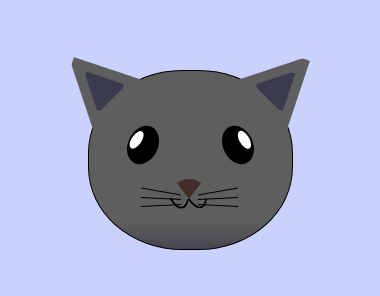

# CSS Cat Painting
CSS positioning for appealing and responsive web layouts practiced in this cat painting. Features include CSS absolute positioning, z-index property, and the transform property.

# Demo
